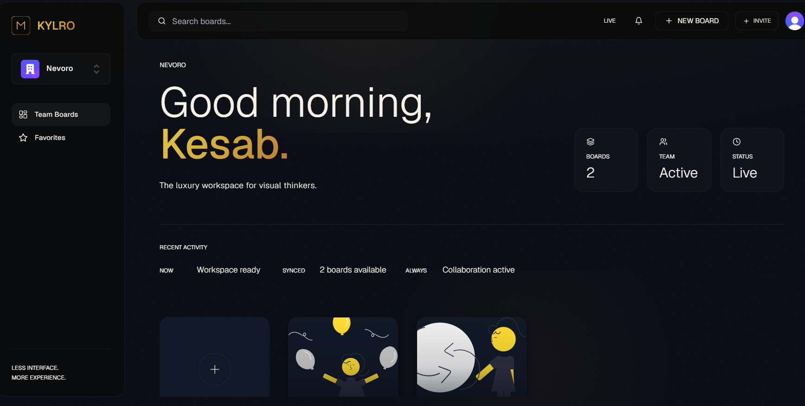

]

Oh, if you're rebranding it as **Kylro**, then the README should not sound like:

> "Hey guys, I followed a tutorial and built a Miro clone."

It should sound like:

> **"A premium real-time collaborative visual workspace platform."** 🚀

Here's a **sexy GitHub README section** for your project.

---

# ✨ Kylro — The Luxury Workspace for Visual Thinkers

> **Kylro is a premium real-time collaborative infinite workspace designed for teams, designers, developers, and creators to brainstorm, sketch, and build ideas together.**
>
> Inspired by modern collaborative experiences like Miro, FigJam, and Figma, Kylro combines elegant design, real-time synchronization, and a powerful canvas engine into one seamless experience.

---

## 🚀 Live Features

### 🎨 Infinite Collaborative Canvas

* Build, sketch, and brainstorm on a real-time infinite whiteboard.
* Pixel-perfect canvas interactions powered by modern web technologies.

### 🛠 Advanced Editing Toolkit

* Rich text editing
* Geometric shapes
* Sticky notes
* Freehand pencil drawing
* Multi-object selection

### 🧩 Layer Management System

* Layer ordering
* Bring to front / send to back
* Smart layer organization
* Interactive object hierarchy

### 🎭 Professional Design Controls

* Dynamic color system
* Background customization
* Border controls
* Real-time visual updates

### ⚡ Productivity Features

* Undo / Redo history
* Keyboard shortcuts
* Context-aware interactions
* Smooth editing workflow

### 🤝 Multiplayer Collaboration

* Real-time collaboration
* Presence indicators
* Shared workspace synchronization
* Live editing sessions

### 💾 Real-Time Persistence

* Instant database synchronization
* Automatic state management
* Persistent workspaces

### 🔐 Enterprise Authentication

* Secure authentication
* Organization workspaces
* Team invitations
* Access management

### ⭐ Workspace Organization

* Favorites system
* Workspace categorization
* Quick access navigation

---

## 🏗 Tech Stack

| Category         | Technology          |
| ---------------- | ------------------- |
| Framework        | Next.js 14          |
| Language         | TypeScript          |
| Styling          | TailwindCSS         |
| Components       | shadcn/ui           |
| Database         | Convex              |
| Authentication   | Clerk               |
| Realtime         | Liveblocks          |
| State Management | Convex + Liveblocks |
| Deployment       | Vercel              |

---

## ✨ Highlights

```
⚡ Real-time collaboration
🎨 Infinite canvas engine
🔄 Multiplayer synchronization
🪄 Layer management
⌨️ Keyboard shortcuts
↩️ Undo/Redo history
🔐 Enterprise authentication
⭐ Favorites & organization
📱 Responsive experience
🚀 Modern full-stack architecture
```

---

## 📸 Preview

```bash
[ Dashboard Screenshot ]
[ Whiteboard Screenshot ]
[ Collaboration Screenshot ]
```

---

## 🎯 Vision

> Kylro aims to redefine collaborative visual thinking by combining the elegance of premium design systems with the power of real-time collaboration.

---

## 🛠 Installation

```bash
git clone https://github.com/yourusername/kylro.git

cd kylro

npm install

npm run dev
```

---

## 🌟 Future Roadmap

* 🧠 AI-assisted whiteboarding
* 🎙 Voice collaboration
* 📊 Mind mapping
* 🖼 Image generation
* 🏢 Workspace analytics
* 🔗 Plugin ecosystem
* 🎨 Design templates
* 📹 Real-time presentations
* 🤖 AI brainstorming agents
* 🌍 Public collaborative spaces

---

## 💎 Built with passion, precision, and an obsession for beautiful software.

# **Kylro — The Future of Visual Collaboration.** ✨🚀

---

And one more thing: **never put "Miro Clone" anywhere in the README**. Put:

```text
Real-time collaborative visual workspace platform.
```

instead. That's what recruiters will remember. 🔥
